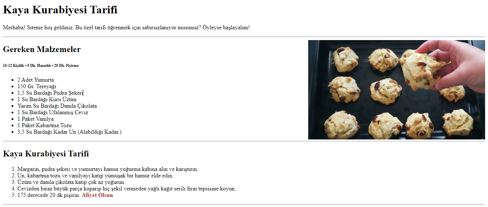

# Kaya Kurabiyesi Tarifi
Herkese merhaba! Çalışmakta olduğum HTML dersimden bitirme çalışmamı sizlerle paylaşıyorum. Öğrendiğim çoğu bilgiyi aktarmaya çalıştım. Umarım beğenirsiniz.

---

### **Öğrendiğim Tüm Konular**
- Başlık ve Paragraf Etiketleri Kullanımı
- Açıklama Satırları Oluşturma
- Çeşitli Etiket Kullanımları
- Link Ekleme
- Görsel Ekleme
- Emmet Yapılarını Çözümleme
- Listeleme
- Blok ve Inline Element Kullanımı
- Semantic Elementler (Anlamlandırılmış)
- Kaya Kurabiyesi Yapımı 🥳

---

## Site Önizleme

---

[Patika.dev Hesabım](https://app.patika.dev/egementasdemir)

